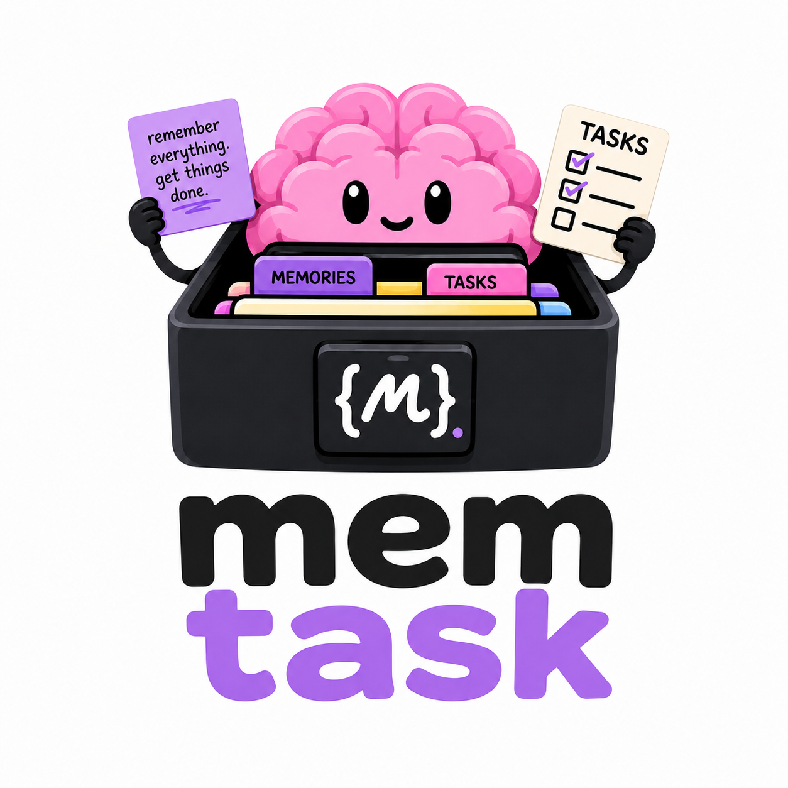

<p align="center">
  
</p>

<h1 align="center">MemTask</h1>

MemTask is a local MCP server for developer-built agents that need durable task state and lightweight memory. It combines task planning, dependency tracking, active work selection, completion history, and scoped memories in a small SQLite-backed service. The goal is to give agents a structured place to manage agency: what to do next, what depends on what, and what context should persist across sessions.

## What It Provides

MemTask exposes two local primitives over MCP:

- Tasks: pending work, stable task references, parent/child dependency edges, active task selection, and completed task state.
- Memories: scoped pieces of context with confidence scores, optional parent memory relationships, tags, and task-memory references.

The server is intentionally local-first. State lives in SQLite, the tool surface is small, and the manager layer can be tested directly without running an MCP transport.

## Run

Install from PyPI once the package is published:

```bash
pip install MemTask
```

From this repo:

```bash
PYTHONPATH=src python -m memory_task_mcp start --transport stdio
```

After installing the package, the console command is available:

```bash
memtask start --transport stdio
```

For background HTTP transport:

```bash
memtask start --transport http --host 127.0.0.1 --port 8000
```

Stop the background HTTP server:

```bash
memtask stop
```

Check server status:

```bash
memtask status
```

Print MCP client configuration examples:

```bash
memtask install-help
```

## Storage

Runtime state in this repo is stored in `data/tasks.sqlite`.

When installed outside this repo, MemTask uses `~/.memtask/tasks.sqlite` by default. Set `MEMTASK_DB_PATH` to choose a specific SQLite path.

The server creates the required SQLite tables on startup using `CREATE TABLE IF NOT EXISTS`. There is no migration framework.

## Tools

Task tools:

- `list_tasks`
- `get_task`
- `add_task`
- `add_batch_tasks`
- `complete_task`
- `remove_task`
- `remove_all_tasks`
- `current_tasks`
- `set_current_task`

Memory tools:

- `remember`
- `recall`
- `get_memory`
- `update_memory`
- `delete_memory`

## Development

Run tests:

```bash
python -m pytest
```

Compile-check the package:

```bash
python -m py_compile src/memory_task_mcp/*.py tests/*.py
```
